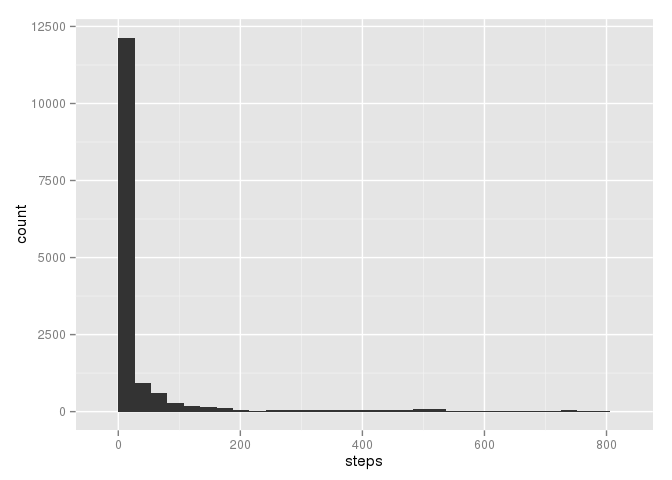
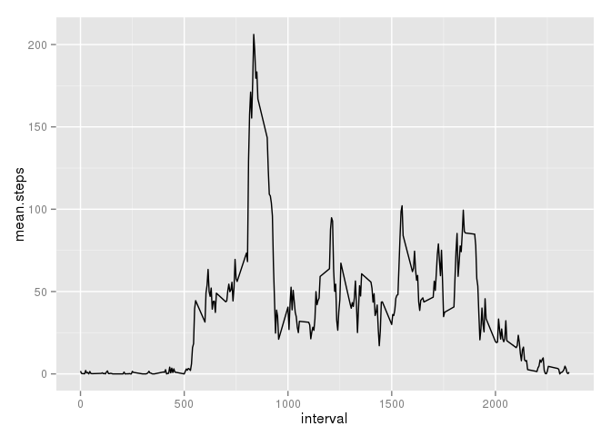
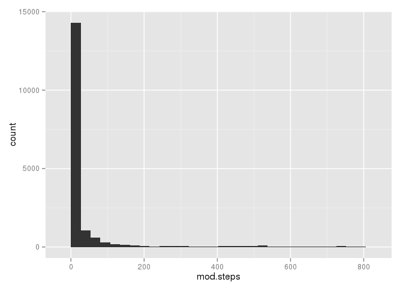
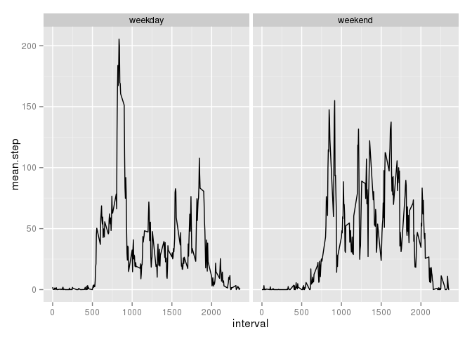

# Reproducible Research: Peer Assessment 1


```r
library(lubridate)
library(ggplot2)
library(tidyr)
library(dplyr)
```

```
## 
## Attaching package: 'dplyr'
## 
## The following objects are masked from 'package:lubridate':
## 
##     intersect, setdiff, union
## 
## The following object is masked from 'package:stats':
## 
##     filter
## 
## The following objects are masked from 'package:base':
## 
##     intersect, setdiff, setequal, union
```

## Loading and preprocessing the data

```r
activity = read.csv("activity.csv")
activity = mutate(activity, date = ymd(date))
```

## What is mean total number of steps taken per day?

Total number of steps taken per day is stored here in variable **total1**:


```r
total1 = sum(activity$steps, na.rm=T)
total1
```

```
## [1] 570608
```

Histogram of the total number of steps taken each day


```r
ggplot(activity, aes(x=steps)) + geom_histogram()
```

```
## stat_bin: binwidth defaulted to range/30. Use 'binwidth = x' to adjust this.
```

 

Mean and median of the total number of steps taken per day are stored in variables **mean.steps1** and **median.steps1**, repsectively


```r
mean.steps1 = mean(activity$steps, na.rm=T)
mean.steps1
```

```
## [1] 37.3826
```

```r
median.steps1 = median(activity$steps, na.rm=T)
median.steps1
```

```
## [1] 0
```

## What is the average daily activity pattern?

I create a data frame called **time.series1** that contains both the mean AND median steps accross all days stored in **mean.steps** and **median.steps**, respectively.  I then plot the **mean.steps** variable versus the **interval** variable.


```r
time.series1 = activity %>% 
    group_by(interval) %>% 
    summarise(mean.steps = mean(steps, na.rm=T), 
              median.steps = median(steps, na.rm=T))

ggplot(time.series1, aes(x=interval, y=mean.steps)) + geom_line()
```

 

The 5-minute interval, on average across all the days in the dataset, that contains the maximum number of steps.


```r
time.series1$interval[match(max(time.series1$mean.steps), time.series1$mean.steps)]
```

```
## [1] 835
```

## Imputing missing values

The Total number of missing values in the dataset.


```r
colSums(is.na(activity))
```

```
##    steps     date interval 
##     2304        0        0
```

Here, I'm choosing to use the median value of the steps per inverval to replace the NA's. So for every interval that has a step with a value of NA in data frame **activity**, I find the corresponding interval in the **time.series** data frame.  For this interval, there is a median value stored in my **time.series1** data frame.  I extract the median value and replace the NA in **activity** with it.


```r
na.steps = is.na(activity$steps)
activity = activity %>% mutate(mod.steps = steps) 
activity$mod.steps[na.steps] = time.series1$median.steps[ match(activity$interval[na.steps], time.series1$interval)]
```

Histogram of the total number of steps taken each day.


```r
ggplot(activity, aes(x=mod.steps)) + geom_histogram()
```

```
## stat_bin: binwidth defaulted to range/30. Use 'binwidth = x' to adjust this.
```

 

Reporting the new total, mean and median values and how they have changed from the initial values.     
- The total increased.     
- The mean decreased.    
- The median did not change.    


```r
total2 = sum(activity$mod.steps, na.rm=T)
total2
```

```
## [1] 579736
```

```r
mean.steps2 = mean(activity$mod.steps, na.rm=T)
mean.steps2
```

```
## [1] 32.99954
```

```r
median.steps2 = median(activity$mod.steps, na.rm=T)
median.steps2
```

```
## [1] 0
```

```r
total2 - total1
```

```
## [1] 9128
```

```r
mean.steps2 - mean.steps1
```

```
## [1] -4.383055
```

```r
median.steps2 - median.steps1
```

```
## [1] 0
```

## Are there differences in activity patterns between weekdays and weekend

Creating a new factor variable named **is.weekend** to distinguish between days that are 'weekdays' or 'weekends'. (I created a second variable named **weekday** to help me validate **is.weekend**).


```r
activity = activity %>% 
    mutate(weekday = factor(weekdays(date)), 
           is.weekend = factor(ifelse(weekdays(date) %in% c('Saturday', 'Sunday'),'weekend', 'weekday')))

time.series2 = activity %>% 
    group_by(interval, is.weekend) %>% 
    summarise(mean.step = mean(mod.steps))
```

Plot containing a time series plot (i.e. type = "l") of the 5-minute interval (x-axis) and the average number of steps taken, averaged across all weekday days or weekend days (y-axis). 


```r
ggplot(time.series2, aes(x=interval, y=mean.step)) + geom_line() + facet_grid(.~is.weekend)
```

 
